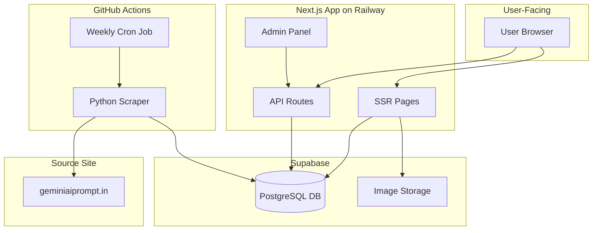
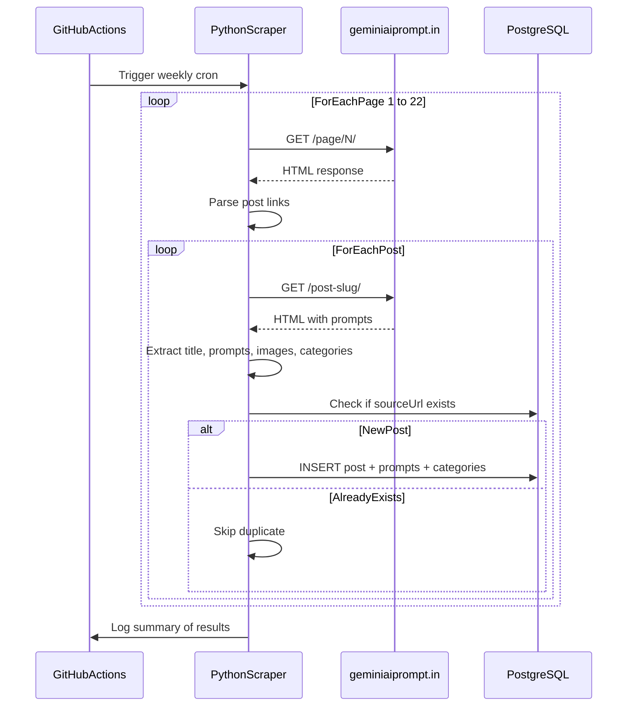

# PRD: AI Prompts Aggregation Website

## 1. Product Overview

A content-driven website that aggregates and showcases AI photo editing prompts for tools like Gemini, ChatGPT, and Midjourney. The site will initially scrape content from [geminiaiprompt.in](https://geminiaiprompt.in/) (~350+ posts across 20+ categories) and allow the owner to add original content via an admin panel. Automated weekly scraping keeps the database fresh.

**Suggested brand names** (to decide later): PromptVault, AiPromptHub, PromptGalaxy, PromptForge, PromptNest

---

## 2. Tech Stack (All Free Tier)

- **Frontend + Backend**: **Next.js 14 (App Router)** + **TypeScript** + **Tailwind CSS**
  - Why Next.js: SSR/SSG for SEO (critical for content sites), built-in API routes (no separate backend), image optimization, file-based routing
  - Why Tailwind: Rapid styling, responsive out-of-box, dark mode support built-in
- **Database**: **PostgreSQL** via **Supabase** (free tier: 500MB storage, unlimited API requests)
  - Why Supabase: Free PostgreSQL with dashboard, built-in auth (for admin), and image storage (1GB free)
- **ORM**: **Prisma** (type-safe database access, auto-migrations)
- **Scraper**: **Python** + **BeautifulSoup4** + **requests**
  - Why Python: Best scraping ecosystem, simple, well-documented
- **Automation**: **GitHub Actions** (free cron jobs, 2000 min/month)
- **Deployment**: **Railway** (starter plan: $5 free credits/month for the Next.js app)
- **Image CDN**: Supabase Storage (1GB free) or external URLs from source

---

## 3. Site Structure & Pages

### Public Pages

- **Home** (`/`) -- Hero section + latest prompts grid (16 per page) + pagination
- **Post Detail** (`/post/[slug]`) -- Title, featured images, multiple expandable prompts with Copy/Share, related posts
- **Category Listing** (`/category/[slug]`) -- Filtered posts by category with pagination
- **Search** (`/search?q=...`) -- Full-text search across all prompts and titles
- **Static Pages**: About, Contact, Privacy Policy, Terms

### Admin Pages (password-protected)

- **Admin Dashboard** (`/admin`) -- Post count, category stats, last scrape info
- **Manage Posts** (`/admin/posts`) -- List, create, edit, delete posts
- **Post Editor** (`/admin/posts/new` and `/admin/posts/[id]`) -- Rich form to add/edit prompts
- **Trigger Scrape** (`/admin/scraper`) -- Manual scrape trigger + scrape logs

### API Routes (built into Next.js)

- `GET /api/posts` -- List posts with pagination, filtering, search
- `GET /api/posts/[slug]` -- Single post with prompts
- `GET /api/categories` -- List all categories
- `GET /api/search?q=...` -- Full-text search
- `POST /api/admin/posts` -- Create post (protected)
- `PUT /api/admin/posts/[id]` -- Update post (protected)
- `DELETE /api/admin/posts/[id]` -- Delete post (protected)
- `POST /api/admin/scrape` -- Trigger scrape manually (protected)

---

## 4. Database Schema

```
Post
  id            UUID (PK)
  title         String
  slug          String (unique, URL-friendly)
  content       Text (HTML description/intro)
  excerpt       String (short summary)
  featuredImage String (URL)
  author        String
  sourceUrl     String? (original URL, null for manual posts)
  isScraped     Boolean (default false)
  publishedAt   DateTime
  createdAt     DateTime
  updatedAt     DateTime

Category
  id            UUID (PK)
  name          String
  slug          String (unique)
  description   String?

PostCategory (join table)
  postId        UUID (FK -> Post)
  categoryId    UUID (FK -> Category)

Prompt (each post has multiple prompts)
  id            UUID (PK)
  postId        UUID (FK -> Post)
  promptText    Text (the full prompt content)
  orderIndex    Int (display order)

PostImage
  id            UUID (PK)
  postId        UUID (FK -> Post)
  imageUrl      String
  altText       String?
  orderIndex    Int
```

---

## 5. Key Features

### 5a. Scraper (Python)

- Crawls all paginated pages on the source site (`/page/1/` through `/page/22/`)
- For each post: extracts title, slug, categories, featured image, all prompt texts, images
- Deduplication via `sourceUrl` (skip if already in DB)
- Stores data into PostgreSQL via direct DB connection or API calls
- Logs scrape results (new posts found, errors)

### 5b. Scraping Automation (GitHub Actions)

- Weekly cron schedule (every Sunday at 2 AM UTC)
- Runs the Python scraper
- Environment variables (DB connection string) stored as GitHub Secrets
- Can also be triggered manually from admin panel or GitHub Actions UI

### 5c. Full-Text Search

- PostgreSQL `tsvector` full-text search on post titles + prompt text
- Search bar in header, results page with highlighted matches
- Debounced search-as-you-type suggestions

### 5d. User Favorites (No Login Required)

- Heart/bookmark button on each post card and post detail
- Stored in browser `localStorage`
- Dedicated `/favorites` page listing all saved prompts
- Persists across sessions (same browser)

### 5e. Dark Mode

- Toggle in header (sun/moon icon)
- Tailwind CSS `dark:` class strategy
- Preference saved in `localStorage`
- Respects system preference by default

### 5f. Prompt Interaction

- Expandable/collapsible prompt blocks ("View Prompt" / "Hide Prompt")
- One-click "Copy to Clipboard" button
- Share to WhatsApp and Telegram buttons
- Direct links to ChatGPT and Gemini

### 5g. Admin Panel

- Simple password-based auth (environment variable, no user management needed initially)
- CRUD for posts and prompts
- Category management
- Manual scrape trigger with status display
- Protected via middleware

---

## 6. Project File Structure

```
gemini/
├── frontend/                         # Next.js application
│   ├── public/
│   │   └── images/                   # Static assets
│   ├── src/
│   │   ├── app/
│   │   │   ├── layout.tsx            # Root layout (header, footer, theme)
│   │   │   ├── page.tsx              # Home page
│   │   │   ├── globals.css           # Tailwind imports + custom styles
│   │   │   ├── post/[slug]/page.tsx  # Post detail page
│   │   │   ├── category/[slug]/page.tsx
│   │   │   ├── search/page.tsx
│   │   │   ├── favorites/page.tsx
│   │   │   ├── about/page.tsx
│   │   │   ├── contact/page.tsx
│   │   │   ├── privacy/page.tsx
│   │   │   ├── admin/
│   │   │   │   ├── layout.tsx        # Admin auth wrapper
│   │   │   │   ├── page.tsx          # Dashboard
│   │   │   │   ├── posts/page.tsx    # Post list
│   │   │   │   ├── posts/new/page.tsx
│   │   │   │   ├── posts/[id]/page.tsx
│   │   │   │   └── scraper/page.tsx  # Manual scrape trigger
│   │   │   └── api/
│   │   │       ├── posts/route.ts
│   │   │       ├── posts/[slug]/route.ts
│   │   │       ├── categories/route.ts
│   │   │       ├── search/route.ts
│   │   │       └── admin/
│   │   │           ├── posts/route.ts
│   │   │           └── scrape/route.ts
│   │   ├── components/
│   │   │   ├── layout/               # Header, Footer, Sidebar
│   │   │   ├── posts/                # PostCard, PostGrid, PromptBlock, Pagination
│   │   │   ├── ui/                   # SearchBar, ThemeToggle, CopyButton, ShareButtons, FavoriteButton
│   │   │   └── admin/                # PostForm, Dashboard
│   │   ├── lib/
│   │   │   ├── prisma.ts             # Prisma client singleton
│   │   │   └── utils.ts              # Helpers (slug generation, etc.)
│   │   ├── hooks/
│   │   │   ├── useFavorites.ts
│   │   │   └── useTheme.ts
│   │   └── types/
│   │       └── index.ts
│   ├── prisma/
│   │   ├── schema.prisma             # Database schema
│   │   └── seed.ts                   # Seed script
│   ├── package.json
│   ├── tailwind.config.ts
│   ├── tsconfig.json
│   └── next.config.js
├── scraper/                          # Python scraper (standalone)
│   ├── scraper.py                    # Main scraping logic
│   ├── db.py                         # Database insertion logic
│   ├── config.py                     # URLs, selectors, settings
│   └── requirements.txt              # beautifulsoup4, requests, psycopg2
├── .github/
│   └── workflows/
│       └── scrape.yml                # Weekly cron + manual trigger
├── .env.example                      # Template for env vars
├── docker-compose.yml                # Local dev (PostgreSQL)
└── README.md
```

---

## 7. Architecture Diagram




---

## 8. Scraping Data Flow




---

## 9. Cost Analysis (Free Tier Breakdown)

- **Railway** (Next.js hosting): Starter plan -- $5 free credits/month (sufficient for low-moderate traffic)
- **Supabase** (PostgreSQL + Storage): Free tier -- 500MB DB, 1GB storage, 50K monthly users
- **GitHub Actions** (scraper automation): Free -- 2000 minutes/month (scraper uses ~5 min/week)
- **Domain**: Optional -- ~$10/year when ready to launch (can use Railway's free subdomain initially)
- **Total recurring cost**: $0/month (within free tiers)

---

## 10. Implementation Phases

- **Phase 1**: Project setup (Next.js, Tailwind, Prisma, Supabase, database schema)
- **Phase 2**: Build public pages (Home, Post detail, Category pages, Pagination)
- **Phase 3**: Build the Python scraper and populate the database
- **Phase 4**: Add extra features (Search, Favorites, Dark mode, Copy/Share)
- **Phase 5**: Build admin panel (CRUD for posts, manual scrape trigger)
- **Phase 6**: Set up GitHub Actions for automated weekly scraping
- **Phase 7**: Deploy to Railway + connect Supabase + test end-to-end

---

## 11. SEO Strategy

- Server-side rendered pages with proper meta tags (title, description, og:image)
- Dynamic sitemap.xml generation
- Clean URL structure (`/post/slug`, `/category/slug`)
- Schema.org structured data for articles
- Canonical URLs to avoid duplicate content issues
- Next.js Image component for optimized loading

